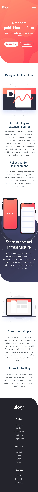

<!-- USE THIS TEMPLATE FOR FUTURE FRONTEND MENTOR PROJECTS, CLEAN CONSISTENT README'S FOR ALL PROJECTS - PAST SELF. -->

<!-- REPLACE HREFS & PROJECT NAMES -->
<h1>Blogr landing page</h1>

  This is a solution to the 
  
  [Blogr landing page challenge on Frontend Mentor](https://www.frontendmentor.io/challenges/blogr-landing-page-EX2RLAApP).
  
  Frontend Mentor challenges help you improve your coding skills by building realistic projects. 

<!-- REPLACE HREFS -->

<!-- REPLACE TASKS -->
<h2>Overview</h2>
Your challenge is to build out this landing page and get it looking as close to the design as possible.

Your users should be able to:
- [x] View the optimal layout for the site depending on their device's screen size
- [x] See hover states for all interactive elements on the page

<!-- IMAGE MAY NEED REPLACING -->

<!-- REPLACE LIST ITEMS -->
<h2>Satisfaction</h2>
<h3>The Good</h3>
  <ul>
    <li>The Semantic and accessibilty for HTML is much better than my previous work.</li>
    <li>The Javascript and use of summary and details.</li>
  </ul>
<h3>The Bad</h3>
  <ul>
    <li>The imagery is a touch off and could do with improving.</li>
    <li>The CSS doesn't contain any variables for the colours, this was just lazy planning!</li>
  </ul>

<!-- UPDATE ENTIRE SECTION -->
<h2>The Process</h2>
<h3>Tools</h3>

  
  
  
  
  

<h3>What I Learnt</h3>
  

    I learnt to only work when focused and upon doing so, I was able to focus more on little details (I usually overlook them).
    The markup for the HTML went really well and hopefully, accessible too.
  

<h3>Continued Development</h3>
  

    I would like to improve the position of the background images and probably move all the colours into variables,
    however; I am mostly happy with this project and will likely not return.
  

  
<!--  Thank you for taking the time to review my projects!  -->
